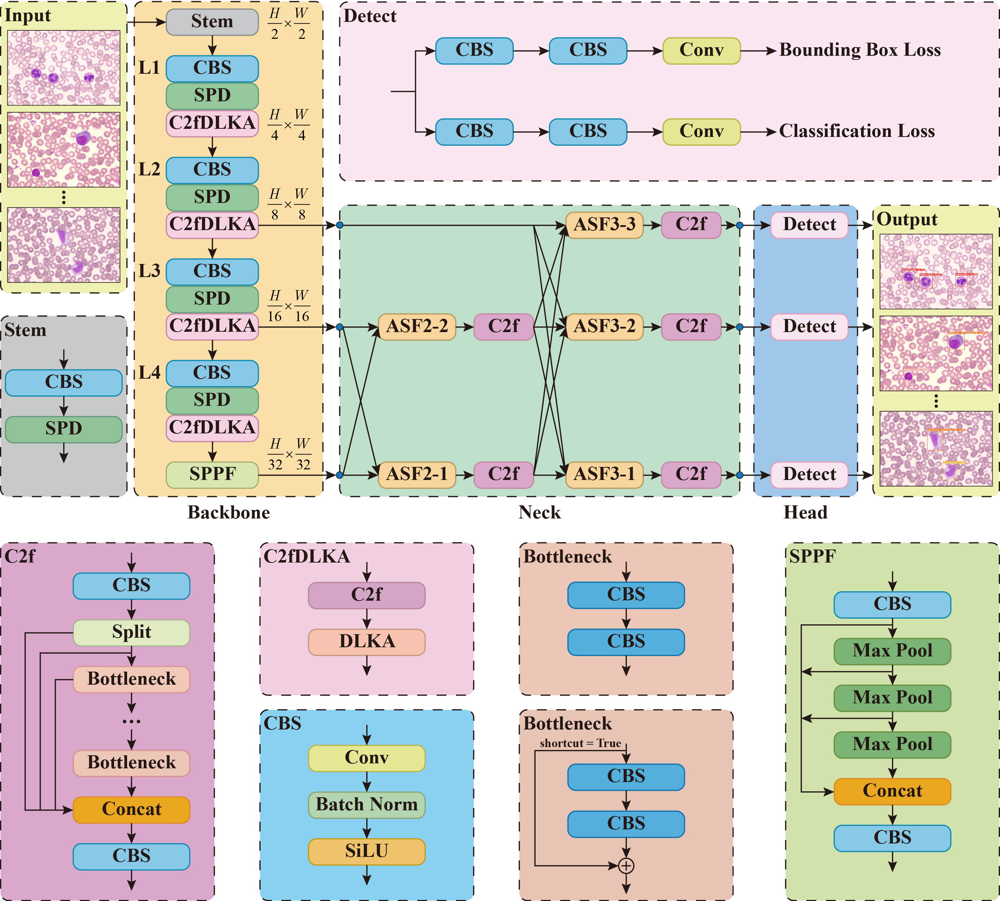

# Highly-efficient differentiation of reactive lymphocytes in peripheral blood using multi-object detection network with large kernels 
⭐ This code has been completely released ⭐ 

⭐ our [article]() ⭐ 

If our code is helpful to you, please cite:
```

```

## Introduction
Reactive lymphocytes are an important type of leukocytes, which are morphologically transformed from lymphocytes. The increase in these cells is usually a sign of certain virus infections, so their detec-tion plays an important role in the fight against diseases. Manual detection of reactive lymphocytes is undoubtedly time-consuming and labor-intensive, requiring a high level of professional knowledge. Therefore, it is highly necessary to conduct research into computer-assisted diagnosis. With the devel-opment of deep learning technology in the field of computer vision, more and more models are being applied in the field of medical imaging. We aim to propose an advanced multi-object detection net-work and apply it to practical medical scenarios of reactive lymphocyte detection and other leukocyte detection. First, we introduce a space-to-depth convolution (SPD-Conv), which enhances the model's ability to detect dense small objects. Next, we design a dynamic large kernel attention (DLKA) mecha-nism, enabling the model to better model the context of various cells in clinical scenarios. Lastly, we introduce a brand-new feature fusion network, the asymptotic feature pyramid network (AFPN), which strengthens the model's ability to fuse multi-scale features. Our model ultimately achieves mAP50 of 0.918 for reactive lymphocyte detection and 0.907 for all leukocytes, while also demonstrating good interpretability. In addition, we propose a new peripheral blood cell dataset, providing data support for subsequent related work. In summary, our work takes a significant step forward in the detection of reactive lymphocytes. 

## Dataset
We utilized peripheral blood cell images supplied by the Laboratory of Hematology at Zhongnan Hospital of Wuhan University for our dataset. The dataset can be obtained from [here](https://pan.baidu.com/s/19lmYhHZoePHysebnLN2cZw?pwd=pip2).
```
/PBC/
  images/
    train/
      P1800000_7.jpg
      ...
    val/
      P1800000_4.jpg
      ...
    test/
      P1800000_5.jpg
      ...
  labels/
    train/
      P1800000_7.txt
      ...
    val/
      P1800000_4.txt
      ...
    test/
      P1800000_5.txt
      ...
```

## Model
We made targeted improvements for leukocyte detection on YOLOv8 from Ultralytics. YOLOv8 is an end-to-end, lightweight, and efficient one-stage detector.

<div style="text-align: center">
  
</div>


## Environment
- Python: 3.9.16
- Pytorch: 2.1.0
- CUDA: 12.1
- GPU: NVIDIA RTX 3060

## Installation
First, clone the repository locally:
```
git clone https://github.com/matr1x-86/Reactive-Lymphocyte-Detection.git
```
Next, install the related packages:
```
pip install -r requirements.txt
pip install einops
pip install timm==0.4.9
pip install mmengine==0.8.4
pip install mmcv==2.0.1
pip install lion_pytorch
```

## Training
Run train.py to start the training process.
```
python train.py
```

## Evaluating
Run val.py to start the evaluating process.
```
python val.py
```

## Results

### 1. Validation set
|   **Methods**           |  **P(%)**  |  **R(%)**  |  **mAP50(%)**  |  **Instances** |
|:-----------------------:|:----------:|:----------:|:--------------:|:--------------:|
| **Eosinophil**          |    90.1    |    79.4    |      87.8      |       68       |
| **Lymphocyte**          |    88.4    |    85.3    |      93.9      |       531      |
| **Monocyte**            |    81.4    |    73.7    |      84.4      |       232      |
| **Neutrophil**          |    84.5    |    90.2    |      92.4      |       976      |
| **Blast**               |    85.9    |    86.1    |      93.8      |       259      |
| **Reactive Lymphocyte** |    82.4    |    83.8    |      91.8      |       400      |
| **ALL**                 |    85.4    |    83.1    |      90.7      |       2466     |

### 2. Test set
|   **Methods**           |  **P(%)**  |  **R(%)**  |  **mAP50(%)**  |  **Instances** |
|:-----------------------:|:----------:|:----------:|:--------------:|:--------------:|
| **Eosinophil**          |    90.6    |    80.0    |      86.8      |       15       |
| **Lymphocyte**          |    82.0    |    91.1    |      93.4      |       270      |
| **Monocyte**            |    71.4    |    79.1    |      81.0      |       110      |
| **Neutrophil**          |    79.3    |    96.4    |      94.4      |       467      |
| **Blast**               |    81.6    |    92.1    |      91.1      |       164      |
| **Reactive Lymphocyte** |    81.7    |    82.7    |      88.2      |       202      |
| **ALL**                 |    81.1    |    86.9    |      89.1      |       1228     |

## Acknowledgements
This code is built on [Ultralytics](https://github.com/ultralytics/ultralytics). We thank the authors for sharing the codes.
